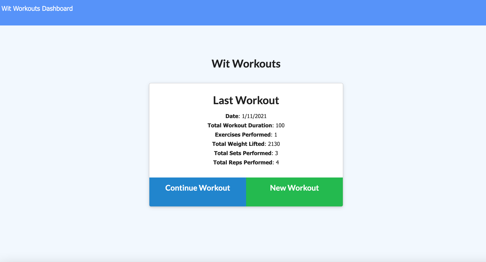
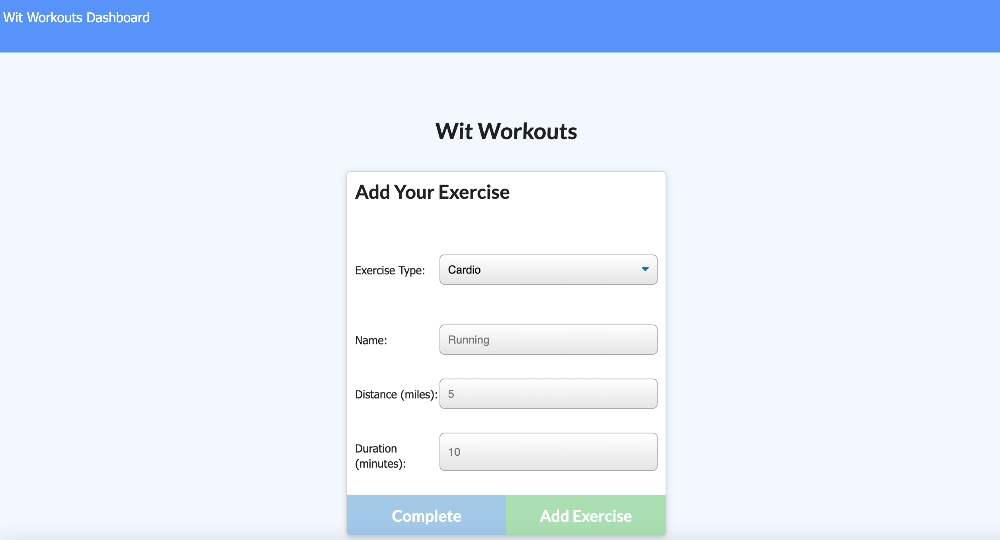
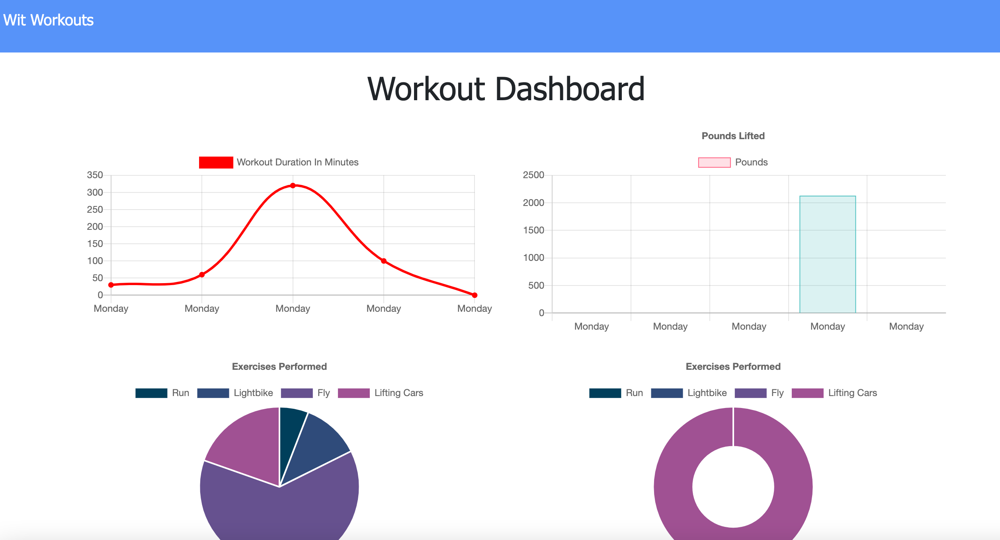

# Wit-Workouts

Track your workouts, with Wit!

## Project Details

Welcome to the Wit Workouts!

Description

Thanks for stopping in!

## Application

Wit Workouts:

Welcome: 
Demo: 

## Build Details

This application was developed using:

## Repository & Preview

View the repository at: https://github.com/MichaelWitt/Wit-Workouts

Preview: 

## Updates

You can find project updates in the repository, highlighting what was done to create the final product.

https://github.com/MichaelWitt/Wit-Workouts/commits/

## Credits

UNC Coding Bootcamp And Trilogy for the inspiration.

Thanks!

## Thanks For Visiting!

Come back soon :)
